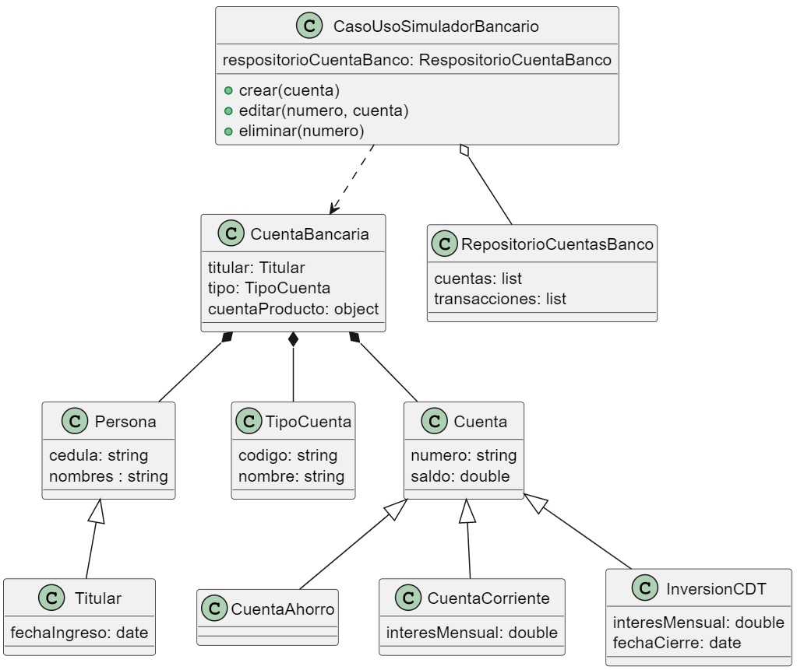
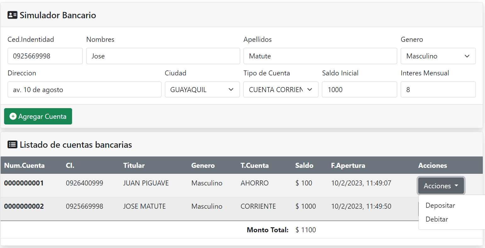

# Unemi-curso-practico-FrontEnd
Desarrollo web JavaScript-Bootstrap-JQuery
## Ejercicios FrontEnd - `Javascript`
### Simulador Bancario
Se quiere crear un programa que permita simular el comportamiento de las cuentas bancarias de un cliente. Un cliente puede tener tres productos financieros básicos:
1.	Una cuenta corriente. El cliente puede depositar o retirar dinero, pero no recibe ningún interés por el dinero que se encuentre allí depositado.
2.	Una cuenta de ahorros. El cliente puede depositar o retirar dinero, y recibe un interés mensual del 0.6% sobre el saldo actual.
3.	Un certificado de depósito a término CDT. Cuando el cliente abre un CDT, define la cantidad de dinero que quiere invertir y negocia con el banco el interés mensual que va a recibir. A diferencia de la cuenta corriente o la cuenta de ahorros, en un CDT no se puede consignar ni retirar dinero. La única operación posible es cerrarlo, en cuyo caso, el dinero y sus intereses pasan a la cuenta corriente.

Estos productos son independientes y tienen comportamientos particulares. El saldo total de la cuenta es la suma de lo que el cliente tiene en cada uno de dichos productos.
El programa debe permitir al usuario:
1.	Visualizar el saldo de la cuenta corriente del cliente.

2.	Visualizar el saldo de la cuenta de ahorros del cliente.

3.	Visualizar el saldo del CDT del cliente.

4.	Visualizar el saldo total que tiene el cliente en los productos del banco.

5.	Invertir un monto de dinero en un CDT.

6.	Cerrar la inversión en CDT.

7.	Consignar un monto de dinero en la cuenta corriente del cliente.

8.	Retirar un monto de dinero en la cuenta corriente del cliente.

9.	Consignar un monto de dinero en la cuenta de ahorros del cliente.

10.	Retirar un monto de dinero en la cuenta de ahorros del cliente.

11.	Avanzar en un mes la simulación.

## Modelo de clases:

## interfaz grafica del simulador bancario:

